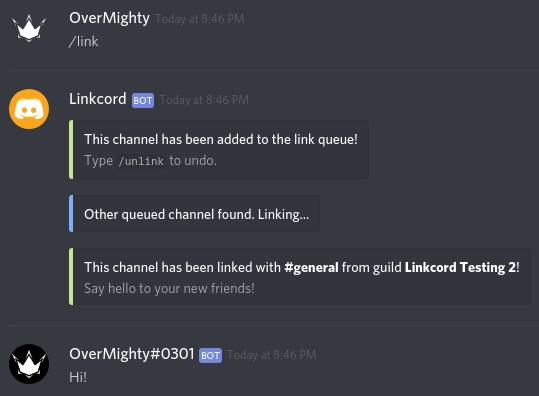
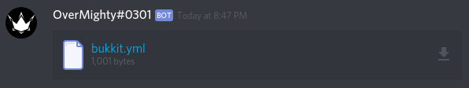
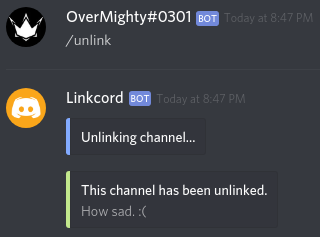
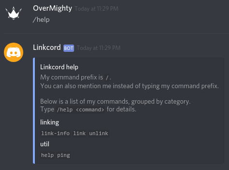

    <h1>Linkcord</h1>
    <blockquote>
        
Discord bot made for Discord Hack Week.

    </blockquote>

## Introduction

Linkcord is a very basic Discord bot that I made for Discord Hack Week using
Node.js along with [discord.js](https://github.com/discordjs/discord.js/) and
[discord-akairo](https://github.com/discord-akairo/discord-akairo).

It lets you link a text channel of your guild with a text channel of another,
random guild that also wants to link one of its text channels.

It will mirror messages, attachments, message edits and message deletion using
webhooks, but will ignore messages sent by bots.

## Usage

#### Prerequisites

- [Node.js](https://nodejs.org/en/)
- [Yarn](https://yarnpkg.com/en/) or [npm](https://www.npmjs.com/get-npm)
- [PostgreSQL](https://www.postgresql.org/)

#### Hosting the bot

1. Clone this repository.
2. Run `yarn install` or `npm install` based on your Node.js package manager.
3. Set up a PostgreSQL database.
4. Create a `.env` file based on the `.env.example` file in this repository.
5. Run `node .` to start the bot.

## Screenshots

---

This project is licensed under the MIT license.
